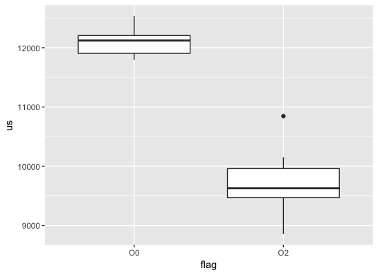

# X6 Notes

## 2: Loop timing
This exercise calls for writing a loop and using `std::chrono` to time. 

Bazel builds the same source twice: one with `-O0` and the other with `-O2`. 10 executions were performed, the results recorded and plotted below.

